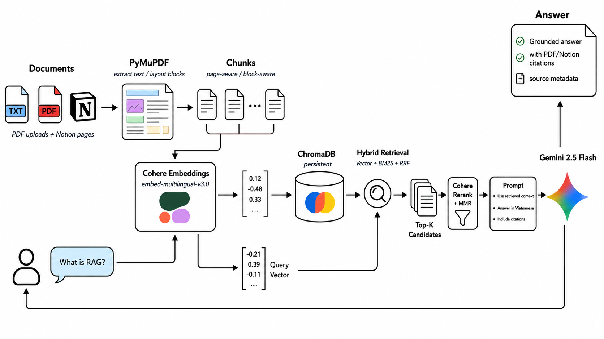
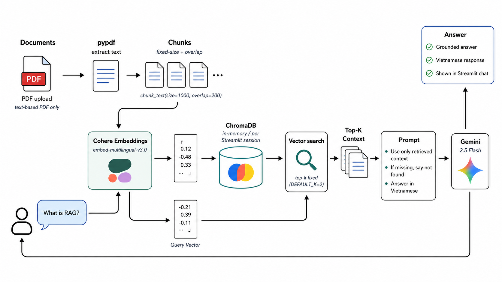

# Tank Tank Bot

Tank Tank Bot is a RAG learning assistant for AIO 2026 learning materials. The repository keeps the original baseline implementation for comparison and the upgraded Streamlit app for deployment.

Baseline Link Demo: https://aio-2026-rag-learning-assistant-8eyegmdv2f2vdkewm8kccv.streamlit.app/

Upgrade Link Demo: https://tank-tank-rag-bot-learning-assistant-n69xd3y5fj8twkik8n3dtm.streamlit.app/

Video Presentation: https://youtu.be/4edPhX62Ph4

<p align="center">
  
  <br>
  <em>UPGRADE ARCHITECTURE</em>
</p>


<p align="center">
  
  <br>
  <em>BASELINE ARCHITECTURE</em>
</p>

## Project Structure

- `baseline/`: reference PDF RAG chatbot version.
- `upgrade_new/`: main upgraded app with PDF/Notion RAG, OCR/Vision, table extraction, ChromaDB, RRF, rerank, MMR, and evaluation tooling.
- `docs/`: project planning, workflow, backlog, and architecture notes.
- `tests/`: root-level smoke and regression tests.
- `.streamlit/config.toml`: Streamlit Cloud config.

## Run Locally

```bash
pip install -r requirements.txt
streamlit run upgrade_new/app.py
```

## Streamlit Cloud Deploy

Use this repository and set the app entrypoint to:

```text
upgrade_new/app.py
```

Add secrets in Streamlit Cloud instead of committing `.env`:

```text
GEMINI_API_KEYS
COHERE_API_KEY
NOTION_TOKEN
NOTION_DATABASE_ID
```

Use `.env.example` as the local configuration template.

