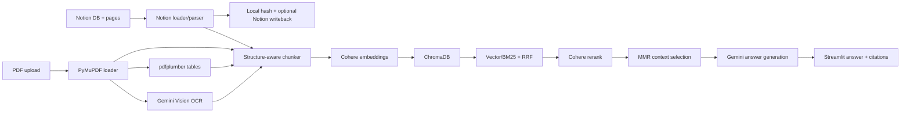

# Project Overview - Tank Tank Bot

## Summary

`upgrade_new/` is the upgraded workspace for Tank Tank Bot, a RAG assistant for AIO 2026 learning materials. It is separated from `baseline/`; the baseline remains a reference implementation and is not modified by upgrade work.

The upgraded system supports two main knowledge sources:

- PDF files uploaded from Streamlit.
- Notion database rows and lesson pages.

The app indexes extracted content into ChromaDB, retrieves relevant chunks with a hybrid retrieval pipeline, and generates grounded Vietnamese answers with citations.

## Baseline vs Upgrade

| Area | Baseline | Upgrade |
| --- | --- | --- |
| Source | PDF-focused | PDF + Notion database/page content |
| PDF parser | Basic PDF text | PyMuPDF layout blocks, optional OCR/Vision, optional table extraction |
| Chunking | Fixed/simple chunks | Page-aware + block-aware + heading-aware + recursive split |
| Metadata | Minimal | Source type, page/title, heading path, block types, table/image/OCR metadata |
| Vector DB | ChromaDB | ChromaDB persistent collection |
| Retrieval | Vector search | Vector + BM25, RRF fusion, Cohere rerank, MMR context selection |
| Notion sync | Not available | Manual full/incremental sync, local hash state, optional Content Hash writeback |
| Evaluation | Basic/manual | Offline JSON/CSV/Markdown reports, optional RAGAS metrics |
| UI | Simple Streamlit | Streamlit sync/index/chat/debug controls |

## Architecture



## Core Modules

- `app.py`: Streamlit UI, PDF upload/index, Notion sync buttons, chat, citations, debug display.
- `src/loaders/pdf_loader.py`: PDF text/layout/image units via PyMuPDF, optional OCR/Vision, table units from `pdf_table_extractor`.
- `src/loaders/notion_loader.py`: Flexible Notion database/page loader, metadata parsing, remote `Content Hash`, hash writeback helper.
- `src/loaders/notion_block_parser.py`: Converts Notion block trees to structured content units, including headings, lists, code, equations, images, and tables.
- `src/chunker.py`: Structure-aware chunking while preserving source metadata.
- `src/embeddings.py`: Cohere multilingual embeddings.
- `src/vector_store.py`: Persistent ChromaDB wrapper.
- `src/retriever.py`: Vector, keyword, and hybrid RRF retrieval.
- `src/reranker.py`: Optional Cohere rerank and MMR selection.
- `src/rag_chain.py`: Builds grounded context and calls Gemini/Cohere generation providers.
- `src/sync/notion_sync.py`: Full/incremental Notion sync, local sync state, content hash checks, writeback counters.
- `src/evaluation.py`: Offline retrieval/generation/RAGAS report generation.

## Data Model

Canonical indexed document:

```python
{
    "id": str,
    "text": str,
    "metadata": dict,
}
```

Important metadata fields:

- Shared: `source_type`, `source_granularity`, `chunk_id`, `block_types`.
- PDF: `source_file`, `document_id`, `page_number`, `page_count`, `bbox`, `table_index`, `ocr_provider`, `ocr_error`.
- Notion: `page_id`, `title`, `week`, `date`, `module`, `lecturer`, `label`, `heading_path`, `notion_url`, `remote_content_hash`.

## Main Capabilities

- Manual PDF indexing from Streamlit.
- Manual Notion incremental sync and full rebuild.
- Empty Notion metadata rows are filtered from indexing.
- Optional Gemini Vision OCR for scanned PDF pages, embedded PDF images, and Notion images.
- Optional PDF table extraction via `pdfplumber`.
- Notion table blocks are rendered as markdown table content.
- Optional Notion `Content Hash` writeback after successful indexing.
- Hybrid retrieval is the recommended default: `hybrid_rrf + Cohere rerank + MMR`.
- Answers are constrained to retrieved context and display source citations.

## Configuration

Required keys:

```bash
COHERE_API_KEY=
GEMINI_API_KEY=
NOTION_TOKEN=
NOTION_DATABASE_ID=
```

Optional flags:

```bash
ENABLE_OCR=true
ENABLE_NOTION_HASH_WRITE=true
NOTION_CONTENT_HASH_PROPERTY=Content Hash
RERANK_PROVIDER=cohere
ENABLE_RERANKING=true
ENABLE_MMR=true
```

For Notion hash writeback, the Notion integration must have `Update content` permission.

## Current Limits

- OCR/Vision depends on Gemini API quota and image accessibility.
- Complex scanned PDFs and complex table layouts still need manual QA.
- Chat memory, HyDE, and query decomposition are intentionally not implemented in this phase.
- The app is designed for local demo/submission use, not hardened multi-user production.
